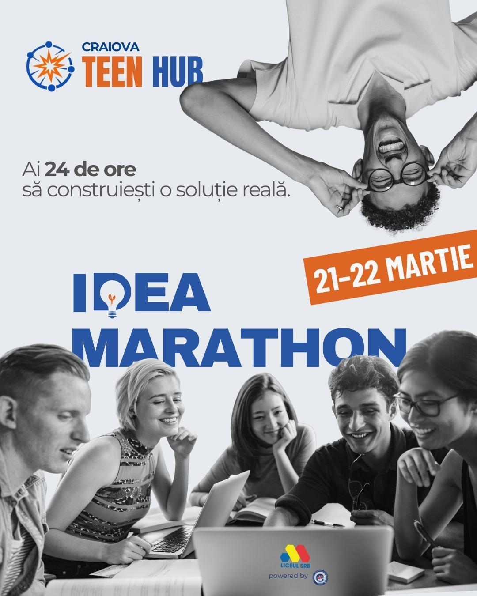
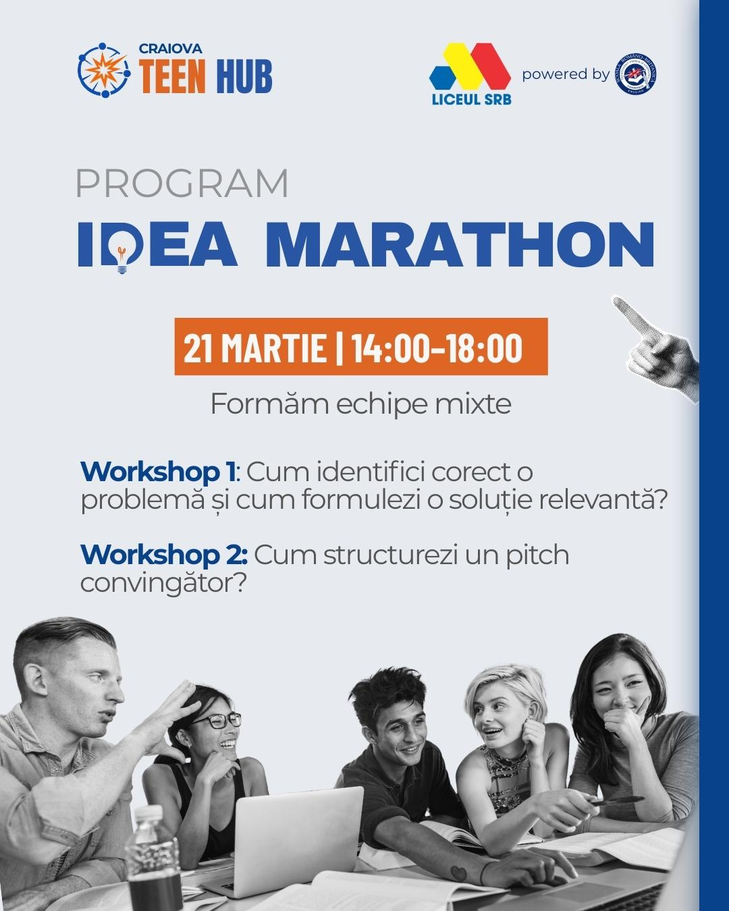
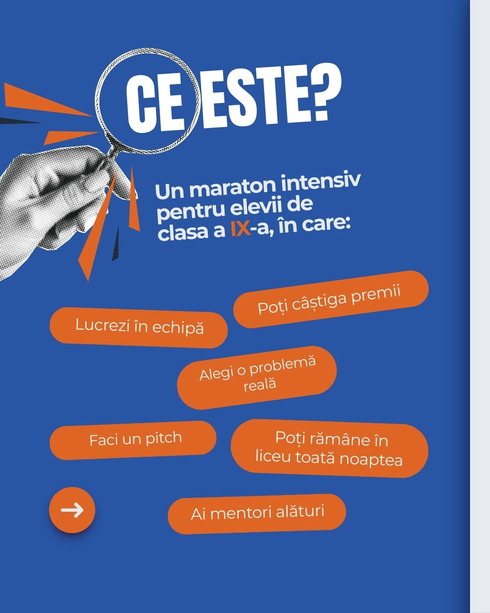
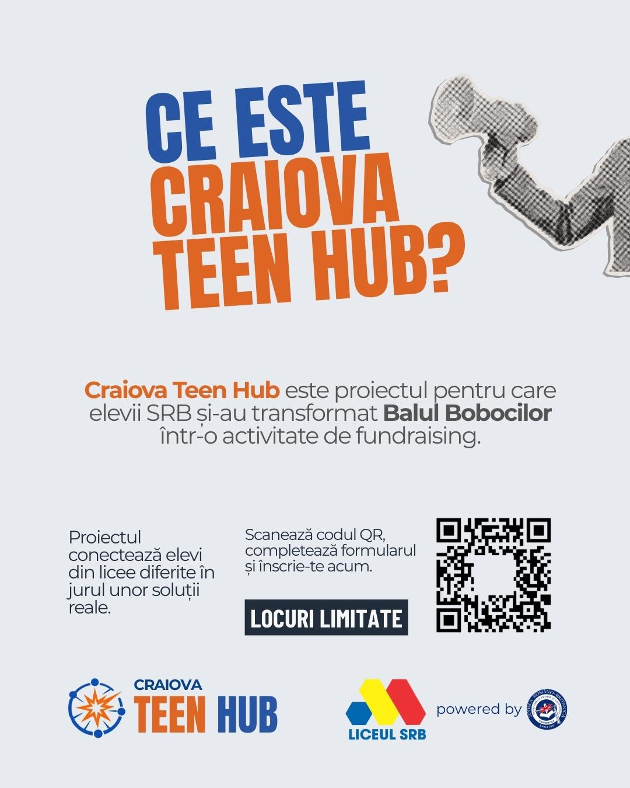
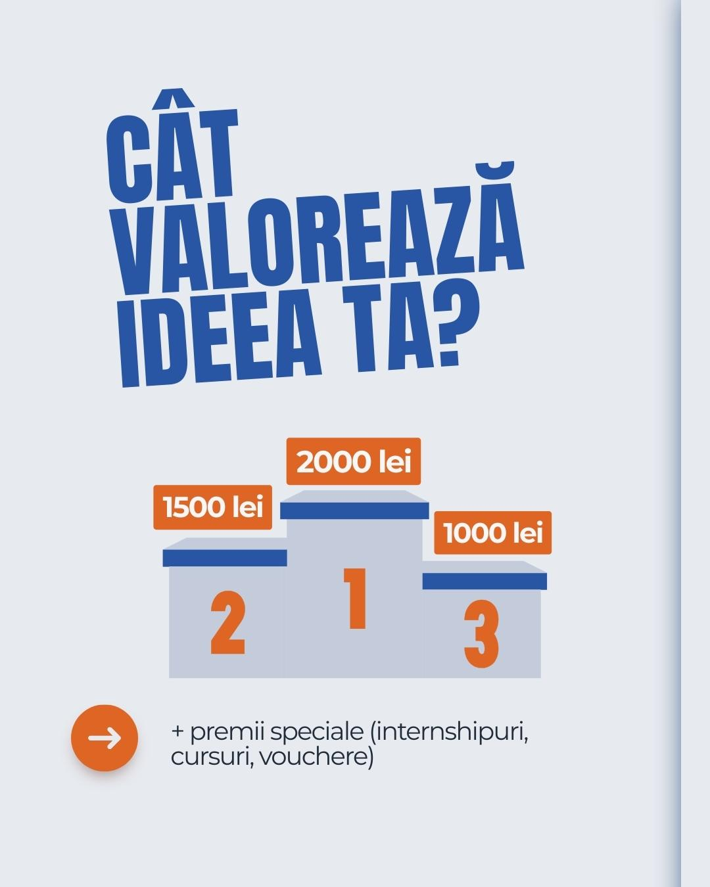
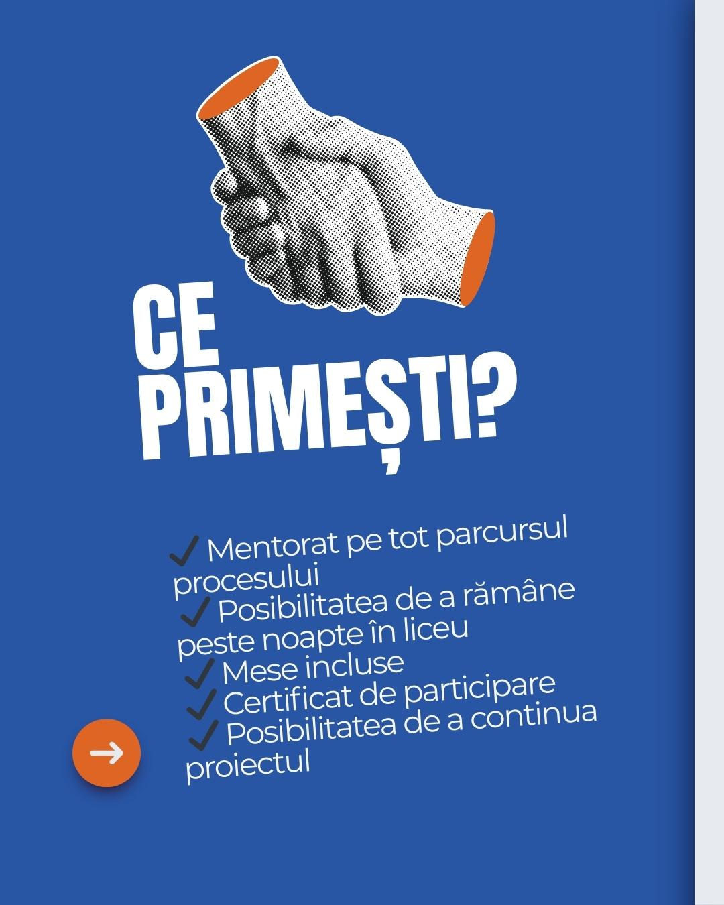

::: {.hero}

::: {.logo-text}
[CRAIOVA]{.logo-craiova} [TEEN HUB]{.logo-teenhub}
:::

# IDEA MARATHON

::: {.tagline}
Ai **24 de ore** sa construiesti o solutie reala.
:::

::: {.date-badge}
21 -- 22 MARTIE 2026
:::

:::

::: {.stats-row}

::: {.stat-item}
::: {.stat-number}
24h
:::
::: {.stat-label}
Maraton non-stop
:::
:::

::: {.stat-item}
::: {.stat-number}
6
:::
::: {.stat-label}
Domenii
:::
:::

::: {.stat-item}
::: {.stat-number}
4500
:::
::: {.stat-label}
lei in premii
:::
:::

::: {.stat-item}
::: {.stat-number}
2
:::
::: {.stat-label}
Workshop-uri
:::
:::

:::

::: {.gallery}

:::

## Ce este? {#despre}

**Craiova Teen Hub** este proiectul prin care elevii Liceului SRB si-au transformat **Balul Bobocilor** intr-o activitate de fundraising. Proiectul conecteaza elevi din licee diferite in jurul unor solutii reale.

**Idea Marathon** este un maraton intensiv pentru elevii de **clasa a IX-a**, in care:

- Lucrezi in echipa cu elevi din alte licee
- Alegi o problema reala din comunitate
- Dezvolti o solutie in 24 de ore
- Faci un pitch in fata juriului
- Poti castiga premii si oportunitati
- Ai mentori alaturi pe tot parcursul

::: {.dark-section}
::: {.inner}

## Ce vrei sa schimbi? {#teme}

Alege o problema dintr-unul din urmatoarele domenii:

<a href="comunitate.html" class="domain-card domain-comunitate">
&#129309;

Comunitate

Solutii care aduc oamenii mai aproape
</a><a href="sanatate.html" class="domain-card domain-sanatate">
&#128154;

Sanatate

Traim mai bine, fizic si mental
</a><a href="mediu.html" class="domain-card domain-mediu">
&#127795;

Mediu & Oras

Un oras mai verde si mai bun de trait
</a><a href="media-digitala.html" class="domain-card domain-media">
&#128241;

Media digitala

Cum consumam si cream continut
</a><a href="educatie.html" class="domain-card domain-educatie">
&#127891;

Educatie

Reinventam modul in care invatam
</a><a href="tehnologie.html" class="domain-card domain-tehnologie">
&#129302;

Tehnologie & AI

Rezolvam probleme reale cu tech
</a>

:::
:::

## Program {#program}

::: {.timeline}

::: {.timeline-item}
::: {.time}
21 Martie | 14:00 -- 18:00 | Idea Marathon
:::

Formam echipe mixte din elevi de la licee diferite.

- **Workshop 1:** Cum identifici corect o problema si cum formulezi o solutie relevanta?
- **Workshop 2:** Cum structurezi un pitch convingator?
:::

::: {.timeline-item}
::: {.time}
21 Martie 18:00 → 22 Martie 14:00 | Start Maraton
:::

Lucrul efectiv in echipe pe solutii:

- Analiza problemei
- Alegerea modelului
- Dezvoltarea solutiei
- Pregatirea pitch-ului

Poti ramane peste noapte. Mentori alaturi de tine. **Mese incluse.**
:::

::: {.timeline-item}
::: {.time}
22 Martie | 14:00 | Prezentarea finala
:::

Pitch-ul in fata juriului, parintilor si invitatilor.
:::

:::

## Premii {#premii}

::: {.prizes}

::: {.prize-card .silver}
::: {.place}
2
:::
::: {.amount}
1500 lei
:::
:::

::: {.prize-card .gold}
::: {.place}
1
:::
::: {.amount}
2000 lei
:::
:::

::: {.prize-card .bronze}
::: {.place}
3
:::
::: {.amount}
1000 lei
:::
:::

:::

**+ premii speciale:** internshipuri, cursuri, vouchere

::: {.dark-section}
::: {.inner}

## Ce primesti? {#beneficii}

::: {.benefits-grid}

::: {.benefit-card}
::: {.benefit-icon}
&#127891;
:::
Mentorat pe tot parcursul procesului
:::

::: {.benefit-card}
::: {.benefit-icon}
&#127769;
:::
Posibilitatea de a ramane peste noapte in liceu
:::

::: {.benefit-card}
::: {.benefit-icon}
&#127829;
:::
Mese incluse
:::

::: {.benefit-card}
::: {.benefit-icon}
&#128220;
:::
Certificat de participare
:::

::: {.benefit-card}
::: {.benefit-icon}
&#128640;
:::
Posibilitatea de a continua proiectul
:::

::: {.benefit-card}
::: {.benefit-icon}
&#129309;
:::
Conexiuni cu elevi din alte licee
:::

:::

:::
:::

::: {.cta-section}

## Vrei sa participi? {#inscriere}

Completeaza formularul si inscrie-te acum.

::: {.limited}
LOCURI LIMITATE
:::

[[INSCRIE-TE ACUM]{.cta-button}](inscriere.qmd)

:::

::: {.site-footer}

::: {.logo-text .logo-text-sm}
[CRAIOVA]{.logo-craiova} [TEEN HUB]{.logo-teenhub}
:::

Liceul SRB | Idea Marathon 2026

:::
